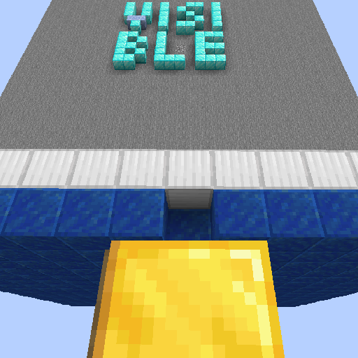

Sodium Occlusion Culling Fix
=====

[Download me on Modrinth](https://modrinth.com/mod/occlusion-culling-fix-sodium)

**This is a FABRIC mod. The 1.18.2 version also works for 1.19.**

This is a mod which "fixes" MC-70850 for MC1.18+ by disabling Occlusion Culling.

It should have been already fixed since it is resolved by Mojang in 1.17. However, [Sodium](https://modrinth.com/mod/sodium) brought it back so we need to fix it again.

Relations
-----

**Suggests** [Sodium](https://modrinth.com/mod/sodium): The issue does not exist without Sodium. In that case, you won't need the mod.

Effect
-----

The chunk with letters "VISIBLE" in it was hidden in vanilla because of [MC-70850](https://bugs.mojang.com/browse/MC-70850). Mojang fixed that in 1.17, Sodium brought it back, and this mod fixed that again. You can get the test save for the bug on Mojira.

Side Effects
-----

This is a temp fix which fixes the bug by breaking features. The side effect of the mod is reducing FPS, but no significant performance drops have been measured so far.

Related Information
-----

This fixes MC-70850 only. Another issue, [MC-63020](https://bugs.mojang.com/browse/MC-63020) causes a similar issue, and was fixed in 1.16.

Incompatibilities
-----

Not found so far.

*Details:* This mod sets `MinecraftClient.getInstance().chunkCullingEnabled` which Sodium reads to false on startup.

Plans
-----

New features will not be added to the mod in order to keep the name descriptive. Please use [Github Issue Tracker](https://github.com/yezhiyi9670/occlusion-culling-fix-sodium/issues) to report bugs.

This mod will not be backported.

- If you play 1.15 or 1.16 and is having the issue, fix it with [this mod](https://www.curseforge.com/minecraft/mc-mods/occlusion-culling-temp-fix).
- If you are the lucky one who is playing MC1.12.2, use [EigenCraft Unofficial Patches](https://github.com/mrgrim/MUP) instead.
