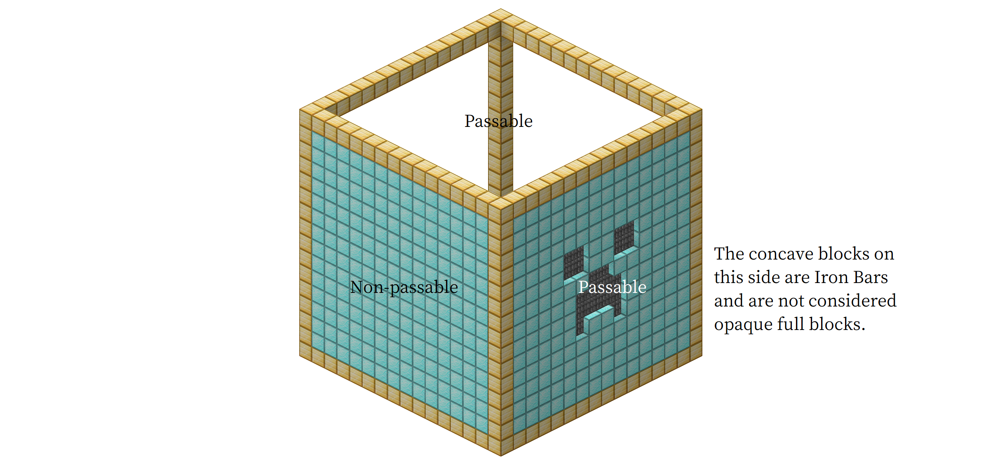
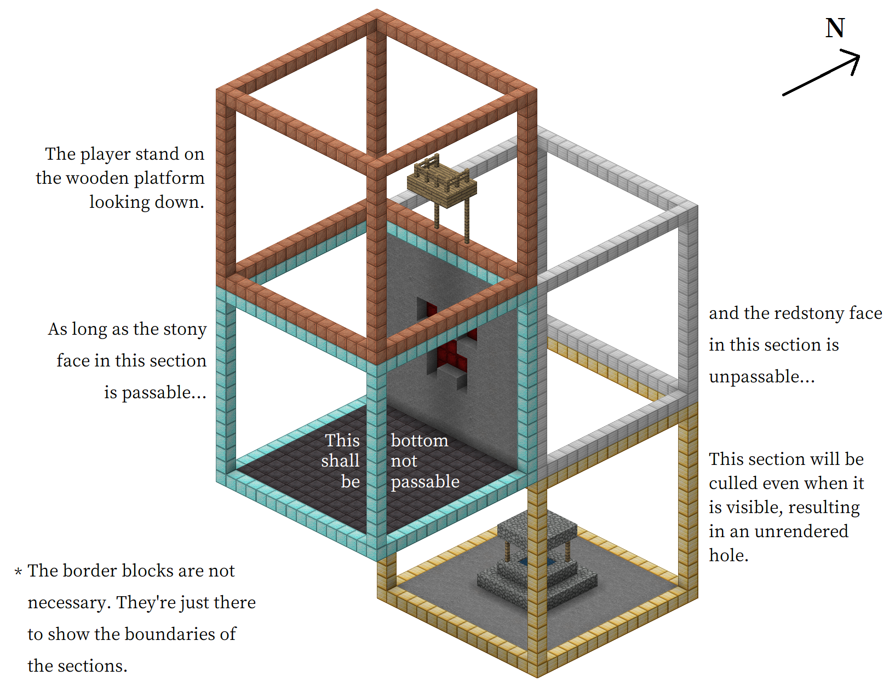
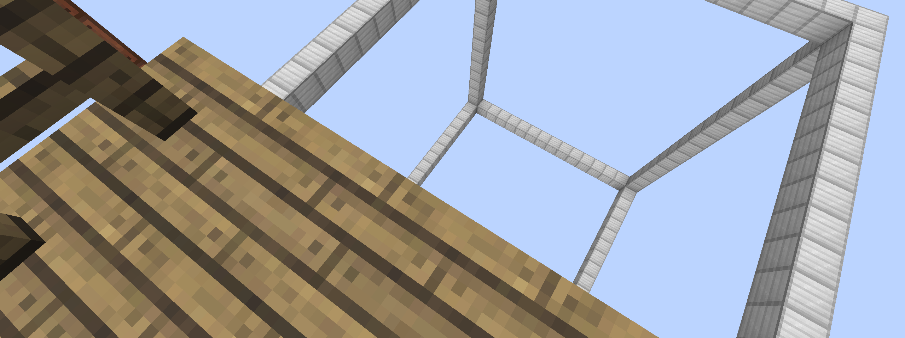
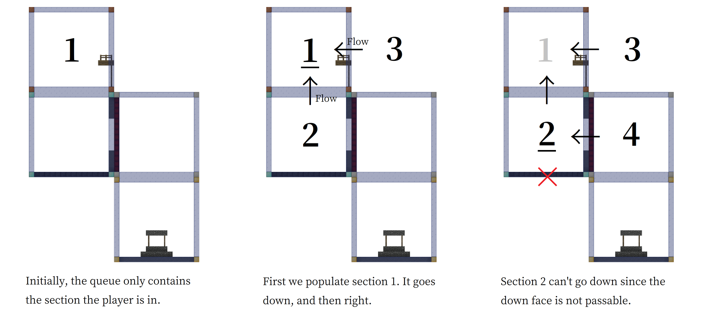
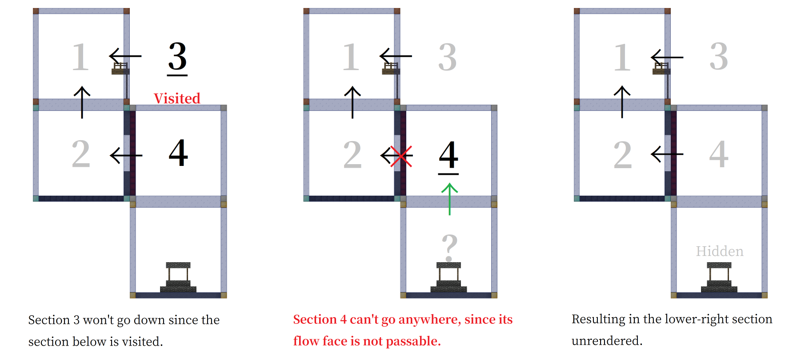

# Code Analysis on Missing Chunks Issue

> Images in this article are created with [Mineshot](https://github.com/pascallj/mineshot-revived-fabric).

Some of you may wonder why such a mysterious missing chunks issue can occur, why it has not been fixed for a long time, and how can it be fixed. Well, though being hidden deeply in the code, the issue is not too hard to explain. In this article, we'll go through the code of Sodium and find out where the issue is.

### What's invisible does not exist

We all know that in order to maintain a nearly infinite world, Minecraft has to divide it into chunks. Chunks are 16x16 square areas in the world, and the 3D size of each chunk is 16x384x16 (in Overworld).

Take a 20-chunks render distance for example. The area within the view distance is approximately $\pi(N(r_{c} - 0.5))^2 = 305815$ blocks. It would be extremely slow if we render them all. Things would be much better if we do optimization so that some invisible chunks can be omitted from rendering. This is called **culling**. To achive this goal, we use two kinds of culling:

- **Frustum Culling** excludes chunks that are outside our field of view, for example, blocks behind us.
- **Occlusion Culling** excludes chunks that are completely hidden by opaque blocks in other chunks and are impossible to be seen.
- Sodium also adds an extra **Fog Culling** that excludes chunks outside the fog distance.

However, this is not good enough. A chunks contains everything in a 16x16 column, so to render the surface, we also have to render the caves which are normally invisible when the player is on the surface. So Minecraft further divides a chunk into several 16-height segments, and each of them can be excluded from rendering or not. These 16x16x16 segments are known as **Render Sections**. When we say chunks in rendering, we are probably referring to sections.

When all kinds of culling work perfectly, we won't be able to notice that some sections are excluded from rendering, because they *should not* be visible. However, if some sections is excluded by mistake, we will see something we call missing chunks, invisible chunks, X-ray chunks, see-through chunks, unrendered holes or anything you can come up with.

As the name of mod suggests, today's issue is about Occlusion Culling, which checks if a section is hidden by opaque blocks in other sections.

### Can you see me?

So how is a section determined to be hidden by opaque blocks? Definitely we can cast rays from the section and see if they're all absorbed by opaque blocks, but this approach is neither efficient nor easy to implement.

Remember we say that the main goal of Occlusion Culling is to exclude the invisible underground caves from rendering? Those caves are usually hidden in the depths and could not be seen even if light could wind its way through obstacles. So one possible way of doing occlusion culling is to simulate a flood-fill (breadth first search if you know computer science) throughout the entire world (within render distance) from the player. What can be filled will be rendered, and what can't be filled are excluded.

Doing flood-fill block by block is still in efficient, so we have to treat a section as a whole. Recall that a section is a 16x16x16 cube and has 6 faces. We consider a face **passable** if the face is not fully covered by opaque blocks. Now we do a flood-fill which only goes through passable faces of sections, starting from the section the player is in. The sections that cannot be filled can be safely excluded from rendering.



To make things more efficient, we add two more constraints:

- **Never-go-back rule**. We only go one way while searching. That is, if we have gone east, we'll never go west; if we have gone up, we never go down, since light won't wind its way up and then back down.
- **In-frustum-only rule**. We only include sections inside the player's field of view, since in fact, light cannot wind its way out of the player's frustum and go back in.

### It went wrong

Theoretically, the flood-fill (or breadth search method) of Occlusion Culling should be correct, and no unrendered holes or something like that could appear. However, many players have come across edge cases that Occlusion Culling is broken, resulting in missing sections. This means implementation is somewhat incorrect and troublesome.

Such edge cases may not be easily found, but they aren't rare indeed. As a result, it has been repeatly reported in the issue tracker by different players. Not buying it? See [this](https://github.com/CaffeineMC/sodium-fabric/issues/872), [this](https://github.com/CaffeineMC/sodium-fabric/issues/722) and [this](https://github.com/CaffeineMC/sodium-fabric/issues/1426).

Actually the issue used to be a vanilla issue, [MC-70850](https://bugs.mojang.com/browse/MC-70850), but it persisted in Sodium for a long time even after Mojang fixed it.

Some minimalistic reproductions can be found on the Mojang issue tracker. But in this article, to diagnose the issue more easily, I'll show mine below:





Download is available [here](./gamesave/reproduction.zip).

It isn't complicated, so we will be able to diagnose it with ease. The next thing is to dive into Sodium's code to find out the issue.

### How the BFS works

The class for handling different sorts of section culling is `me.jellysquid.mods.sodium.client.render.chunk.RenderSectionManager`. The main procedure of the BFS process in Occlusion Culling is `iterateChunks`.

```java
    private void iterateChunks(ChunkRenderListBuilder list, Camera camera, Frustum frustum, int frame, boolean spectator) {
        // Initialization
        this.initSearch(list, camera, frustum, frame, spectator);

        ChunkGraphIterationQueue queue = this.iterationQueue;

        for (int i = 0; i < queue.size(); i++) {
            // Get the current section from queue
            RenderSection section = queue.getRender(i);
            Direction flow = queue.getDirection(i);

            this.schedulePendingUpdates(section);

            // Check and enqueue adjacent sections
            for (Direction dir : DirectionUtil.ALL_DIRECTIONS) {
                // Ignore if certain conditions are met
                if (this.isCulled(section.getGraphInfo(), flow, dir)) {
                    continue;
                }

                RenderSection adj = section.getAdjacent(dir);

                // Enqueue if section is within render distance
                if (adj != null && this.isWithinRenderDistance(adj)) {
                    this.bfsEnqueue(list, section, adj, DirectionUtil.getOpposite(dir));
                }
            }
        }
    }
```

Here we see each section in the queue carries a piece of extra information, `Direction flow`. We'll know what it is later.

First we have a look of the initialization process.

```java
    private void initSearch(ChunkRenderListBuilder list, Camera camera, Frustum frustum, int frame, boolean spectator) {
        <...>

        RenderSection rootRender = this.getRenderSection(chunkX, chunkY, chunkZ);

        if (rootRender != null) {
            // Enqueue the section that the player is in, if exists.

            ChunkGraphInfo rootInfo = rootRender.getGraphInfo();
            rootInfo.resetCullingState();
            rootInfo.setLastVisibleFrame(frame);

            if (spectator && this.world.getBlockState(origin).isOpaqueFullCube(this.world, origin)) {
                this.useOcclusionCulling = false;
            }

            this.addVisible(list, rootRender, null);
        } else {
            // If the player is outside the world height range,
            // then we enqueue every section at the bottom or top of the world.

            chunkY = MathHelper.clamp(origin.getY() >> 4, this.world.getBottomSectionCoord(), this.world.getTopSectionCoord() - 1);

            List<RenderSection> sorted = new ArrayList<>();

            for (int x2 = -this.renderDistance; x2 <= this.renderDistance; ++x2) {
                for (int z2 = -this.renderDistance; z2 <= this.renderDistance; ++z2) {
                    RenderSection render = this.getRenderSection(chunkX + x2, chunkY, chunkZ + z2);

                    <...>

                    if (info.isCulledByFrustum(frustum)) {
                         continue;
                    }

                    <...>

                    sorted.add(render);
                }
            }

            sorted.sort(Comparator.comparingDouble(node -> node.getSquaredDistance(origin)));

            for (RenderSection render : sorted) {
                this.addVisible(list, render, null);
            }
        }
    }
```

In our case, the player is not outside the world, so the BFS queue will only contain one section, namely the section that contains the player.

Next we see what happens when we enqueue a section. They're written in `bfsEnqueue` and `addVisible` method.

```java
    private void bfsEnqueue(ChunkRenderListBuilder list, RenderSection parent, RenderSection render, Direction flow) {
        ChunkGraphInfo info = render.getGraphInfo();

        // [1] Skip if the section is VISITED
        if (info.getLastVisibleFrame() == this.currentFrame) {
            return;
        }

        // [2] Skip if the section is outside the field of view. In-frustum only-rule.
        if (info.isCulledByFrustum(this.frustum)) {
            return;
        }

        // [1] Mark section as VISITED
        info.setLastVisibleFrame(this.currentFrame);
        // [3] Mark the direction of the current step
        info.setCullingState(parent.getGraphInfo().getCullingState(), flow);

        // Call addVisible
        this.addVisible(list, render, flow);
    }

    private void addVisible(ChunkRenderListBuilder list, RenderSection render, Direction flow) {
        // Enqueue
        this.iterationQueue.add(render, flow);

        // Skip if outside the fog range
        if (this.useFogCulling && render.getSquaredDistanceXZ(this.cameraX, this.cameraZ) >= this.fogRenderCutoff) {
             return;
        }

        <...>
    }
```

Here we see that Sodium tries to implement the **never-go-back rule** by recording the directions that has been used along the way. That's what the `CullingState` does.

We also found out what `flow` is. `flow` is the direction that points back to the parent section of a section, that is, the place where the flood-fill came from. **It is recorded when the section is enqueued**.

Until now, all we have seen is about the BFS. We didn't see anything about culling. The code haven't showed how the **never-go-back rule** works, and how we check whether a certain face of a section is **passable**. So finally, we want to check the logic of whether to skip a new adjacent section or not. It is in method `isCulled`.

```java
    private boolean isCulled(ChunkGraphInfo node, Direction from, Direction to) {
        // [3] This uses the CullingState, implementing the never-go-back rule.
        if (node.canCull(to)) {
            return true;
        }

        // Here `from` is the `flow` direction.
        // We check whether the section `isVisibleThrough` the `flow` direction to the `to` direction,
        // the direction that points to the new adjacent chunk.
        return this.useOcclusionCulling && from != null && !node.isVisibleThrough(from, to);
    }
```

Diving a little deeper, we can find that `canCull` is method that checks the `CullingState`, implementing the never-go-back rule, and `isVisibleThrough` returns true if both the `from` and `to` face of the section is **passable**.

Everything seem right, yeah? If you think so, the only option to find out the issue is to simulate the algorithm by hand, on our bug-reproducing scene.

### Simulating our reproduction scene

To simulate the algorithm by hand, we need to know one more thing,

```java
for (Direction dir : DirectionUtil.ALL_DIRECTIONS) {
```

in which order are the directions iterated? We see what `ALL_DIRECTIONS` is, and it goes into the definition of `Direction`, as below:

```java
    DOWN(0, 1, -1, "down", Direction.AxisDirection.NEGATIVE, Direction.Axis.Y, new Vec3i(0, -1, 0)),
    UP(1, 0, -1, "up", Direction.AxisDirection.POSITIVE, Direction.Axis.Y, new Vec3i(0, 1, 0)),
    NORTH(2, 3, 2, "north", Direction.AxisDirection.NEGATIVE, Direction.Axis.Z, new Vec3i(0, 0, -1)),
    SOUTH(3, 2, 0, "south", Direction.AxisDirection.POSITIVE, Direction.Axis.Z, new Vec3i(0, 0, 1)),
    WEST(4, 5, 1, "west", Direction.AxisDirection.NEGATIVE, Direction.Axis.X, new Vec3i(-1, 0, 0)),
    EAST(5, 4, 3, "east", Direction.AxisDirection.POSITIVE, Direction.Axis.X, new Vec3i(1, 0, 0));
```

That's obvious. We should go down first.

This is a 3D problem and might be complicated. However, thanks to the never-go-back rule, we can completely ignore the X axis, and treat it as a 2D problem on the Z-Y plane. Also, we only consider the six sections visible in the screenshot. Here we go.





That's the issue. When a chunk is pulled out from the queue, it always check whether its `flow` face is passable or not, which is recorded when enqueueing and is somewhat "biased".

### Let's fix it

A possible fix may be ignoring the `flow` direction, and only check the `to` direction. So we iterate all the posible directions as `flow` and check `isVisibleThrough`. If one of them returned true, then we should not cull the adjacent chunk.

This is what we did in this mod.

```java
    @Overwrite
    private boolean isCulled(ChunkGraphInfo node, Direction from, Direction to) {
        if (node.canCull(to)) {
            return true;
        } else {
            boolean cullable = true;
            for(Direction direction : DirectionUtil.ALL_DIRECTIONS) {
                if(node.isVisibleThrough(direction, to)) {
                    cullable = false;
                    break;
                }
            }

            return this.useOcclusionCulling && cullable;
        }
    }
```
